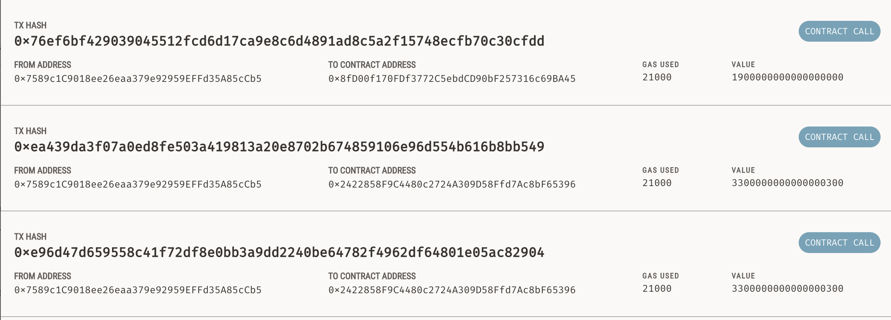

# Fintech_Finder

Fintech Finder is an application that its customers can use to find fintech professionals from among a list of candidates, hire them, and pay them.

Please be sure to install all the prerequisites (libraries) before running the program:

- `pip install streamlit`
- `pip install web3`
- `pip install bip44`

Here is an example of the Fintech Finder Web App:

You can see that the transcation was successful when paying _Ash_ (see the account address in the transaction):

This is also showing that the amount that was sent out to the professionals matches what's left:

